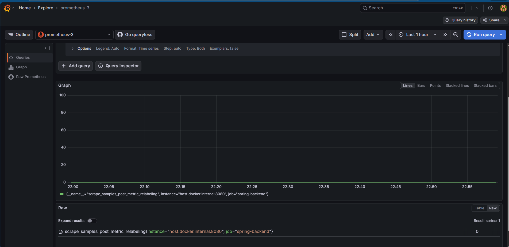
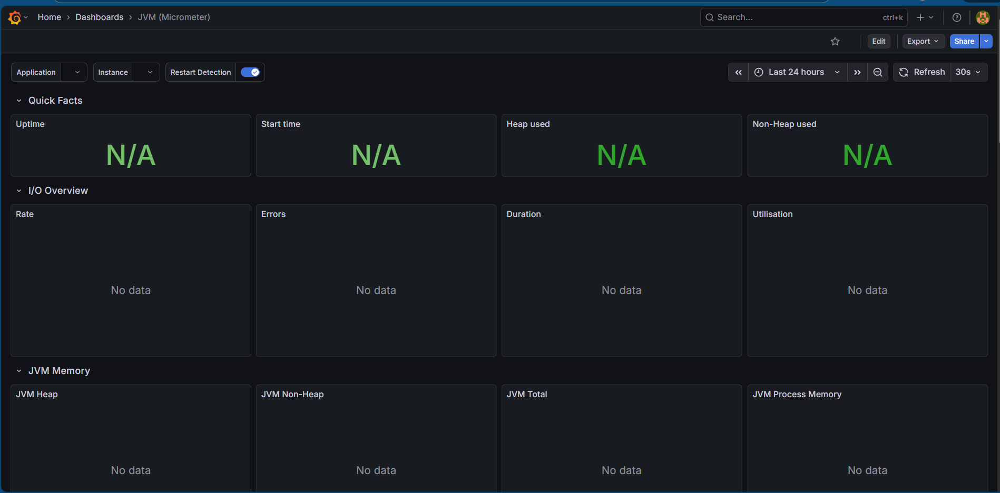
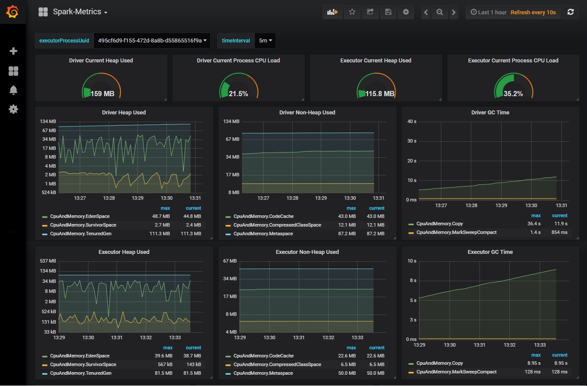

# Food Ordering App with Monitoring

Đây là project **Food Ordering App Full-Stack**:

- **Backend:** Spring Boot (Java 21, Maven)
- **Frontend:** React
- **Database:** MySQL
- **Payment:** Stripe
- **Authentication:** JWT
- **Monitoring:** Prometheus + Grafana + MySQL Exporter

Monitoring giúp **quan sát memory, CPU, request metrics, và MySQL performance** realtime.

---

📁 Cấu trúc thư mục

├── backend/            # Spring Boot backend

├── frontend/           # React frontend

├── monitoring/         # Monitoring stack

│   ├── docker-compose.yml

│   ├── prometheus/

│   │   └── prometheus.yml

│   └── grafana/

│       └── provisioning/

├── .gitignore

└── README.md

---

## Bước 1: Chuẩn bị môi trường

1. Cài đặt:

- Docker & Docker Compose
- Java 21
- Node.js 20+
- Maven (cho backend)

2. Cập nhật MySQL:

- MySQL đang chạy local hoặc Docker
- Note user/password và port (mặc định 3306)

---

## Bước 2: Cấu hình Monitoring

1. Mở file `monitoring/docker-compose.yml`
2. Cập nhật MySQL Exporter:

```yaml
mysql-exporter:
  image: prom/mysqld-exporter
  container_name: mysql-exporter
  environment:
    DATA_SOURCE_NAME: "root:123456@(host.docker.internal:3306)/"
  ports:
    - "9104:9104"
```

* Thay `root:123456` bằng **user/password MySQL của bạn**
* Nếu MySQL chạy trong Docker Compose → thay `host.docker.internal` bằng **tên service**

3. File Prometheus config: `monitoring/prometheus/prometheus.yml`
   ```
   global:
     scrape_interval: 5s

   scrape_configs:
     - job_name: "spring-backend"
       metrics_path: "/actuator/prometheus"
       static_configs:
         - targets: ["host.docker.internal:8080"]

     - job_name: "mysql"
       static_configs:
         - targets: ["mysql-exporter:9104"]

   ```

## Bước 3: Chạy monitoring stack

```
cd monitoring
docker-compose up -d
```

* Grafana: [http://localhost:3001](http://localhost:3001)
* Prometheus: [http://localhost:9090](http://localhost:9090)
* MySQL Exporter: port 9104

Kiểm tra container:

```
docker-compose ps
```

## Bước 4: Chạy backend Spring Boot

```
cd backend
./mvnw spring-boot:run
```

* Backend phải chạy để Prometheus scrape metrics
* Kiểm tra: [http://localhost:8080/actuator/prometheus]()## Bước 5: Cấu hình Grafana

## Bước 5: Cấu hình Grafana

* Mở [http://localhost:3001](http://localhost:3001)
* Login: `user: admin / password: admin`
* Menu ⚙️ → **Data Sources → Add → Prometheus**

  * URL: `http://prometheus:9090`
  * Save & Test → “Data source is working” ✅
  * Test bằng lệnh truy vấn (minh họa trang truy vấn)
  * 
* Import Dashboard:

  * Click **+ → Import**
  * Dashboard ID: `4701` (Spring Boot metrics)
  * Chọn datasource: Prometheus → Import

## Bước 6: Kiểm tra dashboard

* CPU, Memory, Thread, Request metrics của Spring Boot
* MySQL metrics qua MySQL Exporter

> Nếu backend chưa chạy → dashboard trống, nhưng datasource vẫn kết nối OK
>
> 
>
> Nếu datasource đã được conect
>
> 
>
> ## Bước 7: GitLab CI/CD (tuỳ chọn)
>
> File `.gitlab-ci.yml` có thể:
>
> * Test backend (Maven)
> * Test frontend (React)
> * Build Docker images
> * Start monitoring stack (Prometheus + Grafana + MySQL Exporter)
>
> Ví dụ pipeline stages:
>
> ```
> backend_tests → frontend_tests → build → monitoring
> ```
